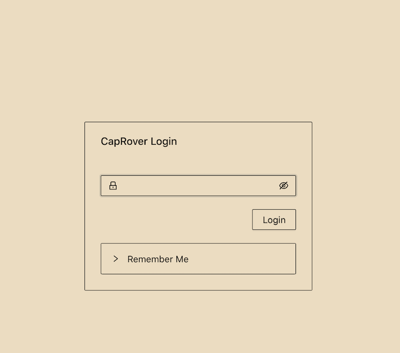
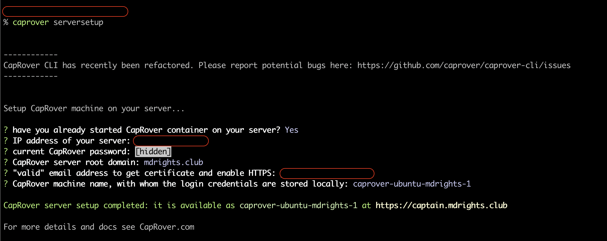

# 搭建一个数据自主的问卷调查网站

## 缘起
网络空间越来越逼仄，生活在互联网和大数据时代的我们想要活得自在，不那么容易。除非做原始人，几乎无人能完美躲避来自政府的言论审查和来自 IT 巨头的数据剥削两方面的夹击。

即使这样，我们仍想尽力挤出一点空间来，让这个网络更自由和更自主。

如果你一直在苦苦寻找一个不被言论审查的问卷调查服务，而且问卷数据可以自己掌控（比如导出、删除），那何不自己搭建一个呢？雖然 GFW 能輕易地把我們自己搭建的網站給牆了，但不至於問卷上的問題發不出來（通常對於小網站 GFW 只會進行 DNS 污染 ——這樣只需要換個域名就可）。

現在搭建網站的技術門檻越來越低啦，只需要 2 條命令就能搭建啦！需要的條件只是：擁有一個域名 + 租一台虛擬主機（VPS，$5/月）；當然如果你的電腦是 mac 或 Linux 就更好了。


## OhMyForm: 自由開源問卷服務軟件
幸好這個世界有[自由開源軟件](https://www.gnu.org/philosophy/free-sw.html)（Free and Open Source Software, FOSS），僅僅公開了源代碼是不夠的，還需要允許任何人使用、運營、修改和發佈自己的版本，即 Free as in Freedom。

[OhMyForm](https://ohmyform.com/) 是一款 nodejs 寫的很輕量的自由開源軟件，雖然功能較為簡單但實際夠用了，它有十幾種表單可選（包括選擇、填空等等）。

OhMyForm 再加上 [Caprover](https://caprover.com/docs/get-started.html) —— 一個自動化軟件發佈平台軟件（PaaS），不需要理解軟件發佈的原理就能把很多常用的服務端軟件（包括 OhMyForm）發佈到你指定的 VPS 服務器上，通常只需要[幾個點擊](https://caprover.com/docs/one-click-apps.html)， 兩個命令只是用來在你的本地電腦安裝 CapRover 而已。


## 第一步：租 VPS 并部署 Caprover
由於 Caprover 跟 主機服務商 DigitalOcean (DO) 有合作，所以在 DO 上開個 VPS 後可以直接一鍵部署 Caprover。（如果不選擇 DO，其他的主機服務商都可以，不過就是多一些部署命令，詳見：[Caprover 官方文檔 的第一和第二步](https://caprover.com/docs/get-started.html#caprover-setup)  

選擇創建（Create）一個 Droplet（即雲主機）：


在創建頁面選擇【Marketplace】，找到 `Caprover`，其他按照默認的就好（如果你預期會有很大的訪問量則可以選擇大的 Plan；也可以選擇一下地點，地點不同速度也不同）。


靜等片刻，部署好了之後，你應該能用 VPS 的 IP 加端口號（3000）來訪問到 Caprover 啦（比如：http://xx.xx.xx.xx:3000）。


## 第二步：設置 DNS
去你買域名的服務商那裡，在 DNS 紀錄那一頁（每個服務商的頁面會不一樣），修改 A 紀錄。比如你的域名是 `atgfw.club`，你想讓問卷網站的地址是 `mysurvey.atgfw.club`，那麼需要添加一條紀錄（这里不详细介绍了）：  

```
Type  Name   IPv4 address
A       *      xx.xx.xx.xx （<--你的 IP）
```


设置好 DNS 后可能需要等几分钟～几小时才能生效。生效后可以用域名访问你的 Caprover 服务器咯，比如我的就是 `atgfw.club`。這個時候還只能訪問 3000 端口，所以要這樣訪問：`http://atgfw.club:3000`（注意是 **http://**）。    

登录到上面的这个网址，默认初始密码是 `captain42`。进入后第一件事就是要改密码（在「设置」里）。 


讓 Caprover 知道我們的域名。在「Dashboard」页面，填上在第二步设置 DNS 时用到的域名，比如我的就是 `atgfw.club`。然后点击「Update Domain」，記得之後再点下「Enable HTTPS」，然後是【Force HTTPS】。  


> 然而，官方說這裡可能會有bug，最好用命令行最高效可靠。

如果刚才这步遇到报错，那么请立即打開你的 macbook 的 Terminal （終端），輸入：  

```
  sudo npm i -g caprover  （會要求輸入你的登錄密碼）
```

然後把 DNS 配上（照著它的提問填入相關信息即可）：

```
  caprover serversetup
```



這時我們應該能訪問正式的安全的域名啦：`https://captain.atgfw.club`（我的例子）。  


## 第三步：部署 OhMyForm

点击「Apps」页面，我们要开始安装 OhMyForm了。点击「One-click Apps/Databases」。  


点击上图的 OhMyForm 框框，就进入到安装页面，需要输入一些关于你的软件的信息，包括：  
    - App Name:        起个名字，会成为网址的一部分（这里以 `csoform` 为例）；  
    - Admin E-Mail:    设置管理员邮箱，~~用于找回密码~~；  
    - Admin user name: 设置管理员账号，会是整个软件里最高权限的账号；  
    - Admin password:  系统生成的密码，请保存好；  
    - Database user:   存储问卷数据的账号；  
    - Database password: 数据库账号的密码；  
    - Title:           显示在浏览器的标题栏上。    

点击「Deploy」后等待一小会，就大功告成啦～   

  

3. 接下来我们还需要为我们的网站加上 HTTPS，加强安全。在「App」页面，分别点击链接「csoform」和「csoform-api」（你可以是你自己定义的名称），点击蓝色的「enable HTTPS」按钮，然后点击「save & update」。  


 
然后 -->  


记得 「csoform-api」（你有你定义的名称）也要这么操作。  

最后，访问 `https://csoform.xxxxxx.xxx` 试试看～ （以后日常使用都是访问这个地址了）  


----------------------------- 以上是部署时才需要的操作，以下是使用时经常要操作的 -------------------------------

## 創建用戶並賦權
首先，只有部署時創建的那個用戶`ohmyadmin` （是Super User）和被賦予 admin 的用戶可以製作問卷。  

請你的同事/隊友在登錄頁面註冊一個帳號，你（網站的搭建者）用 ohmyadmin 登錄並為他們賦予 admin 權限。


## 製作問卷
進入【Forms】頁面即可一步一步開始製作問卷啦～


## 發放問卷
每個問卷頁面會生成一個可任何人訪問的網址，不需要認證或註冊。  


## 查看並導出問卷數據
在每個問卷頁面都有【Submissions】這樣的按鈕，即填問卷的人提交的答案。當然也可以導出啦～！問卷數據都存在你的開通的服務器上（比如 DO），不會與第三方分享。 


<hr />

## Enjoy!
