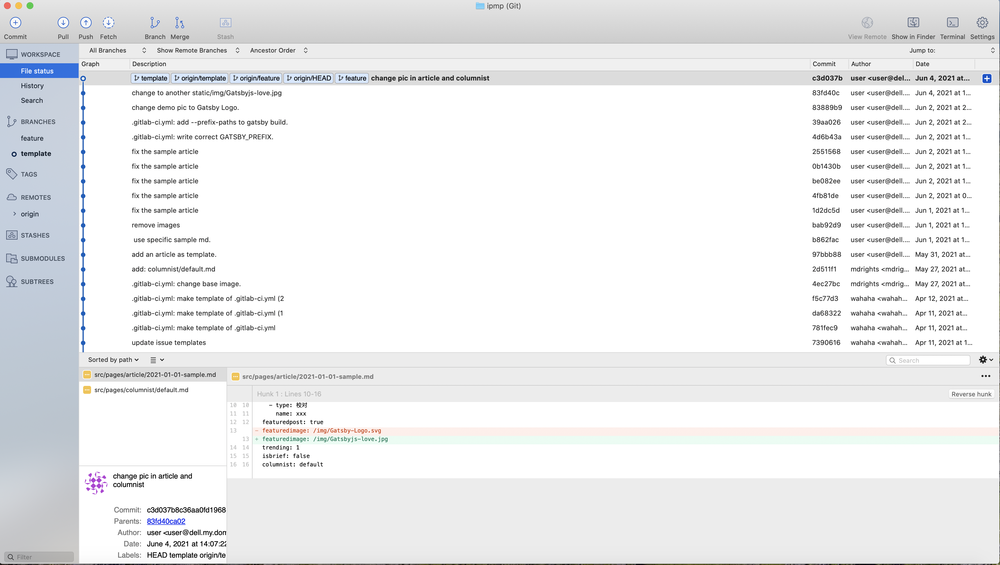
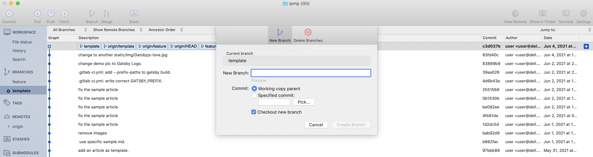
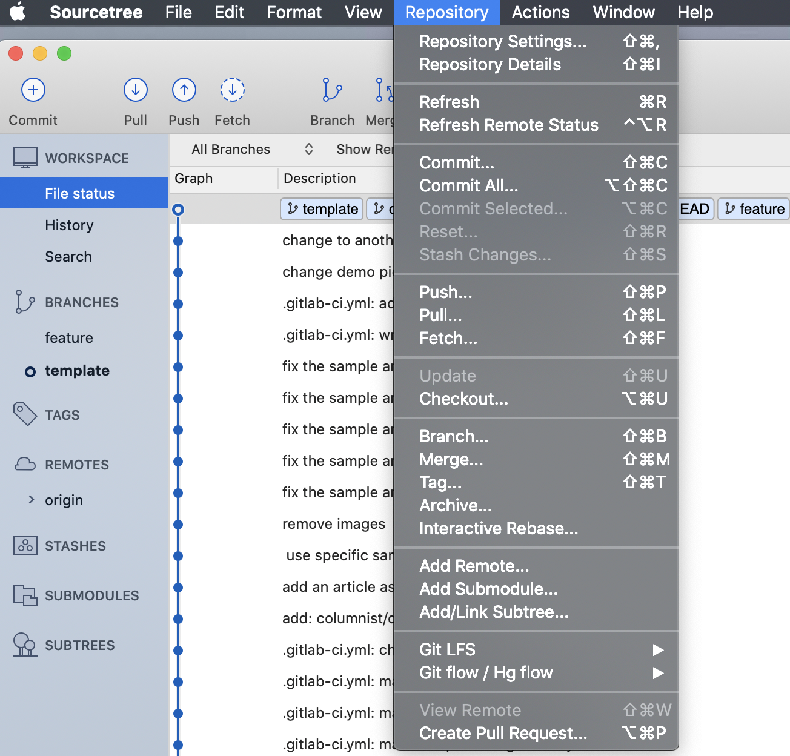
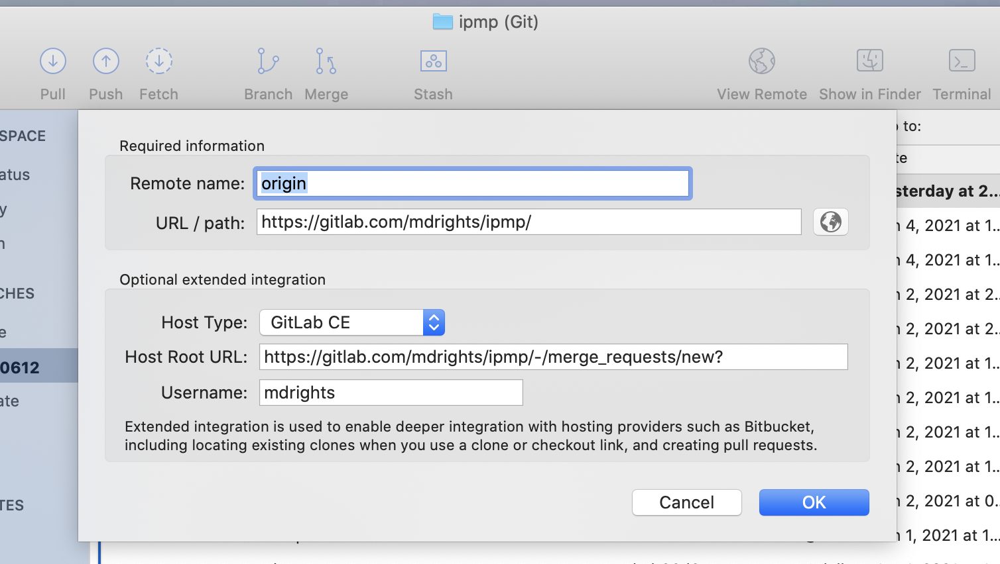
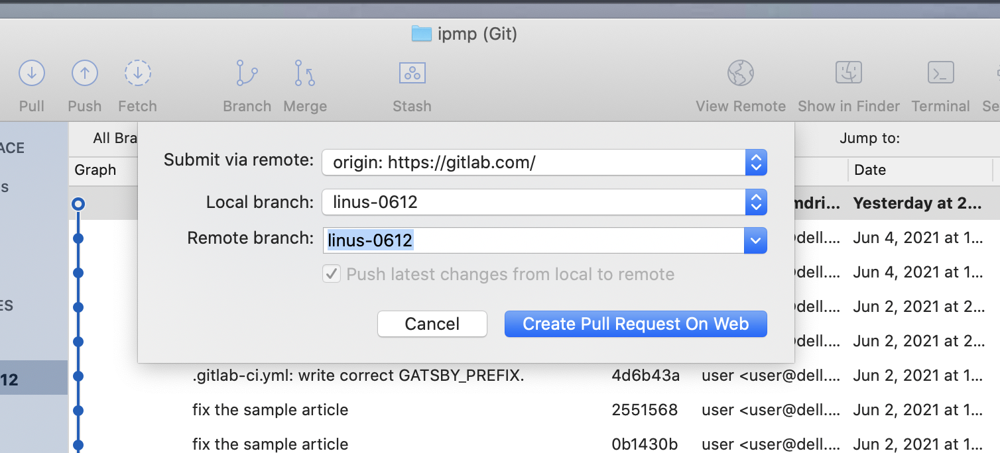
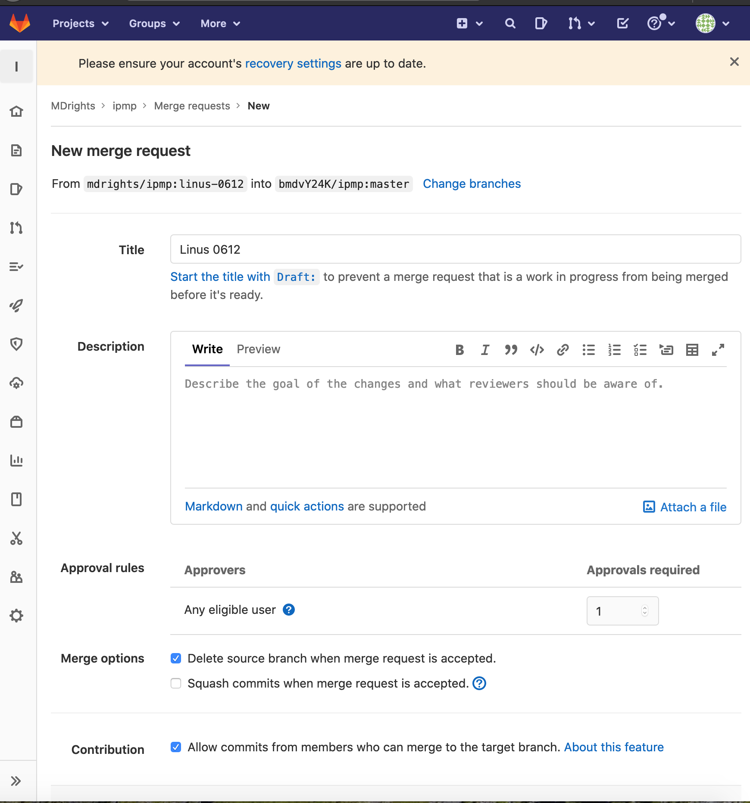

---
---

how-to-raise-PR-sourceTree.md

# 如何用 SourceTree 申請審批（PR/MR） 

> Git 是非常強大的版本管理工具，不僅是對程序員的代碼，對於所有文本（甚至二進制文件）都可以進行版本管理和多人協作。  
本文想給非 coder 簡單介紹介紹如何用 Gitlab （平台）進行多人協作過程中的審批功能（注只是為了方便非技術人士理解，其功能本身就是 GitHub 的 Pull Request 和 Gitlab 的 Merge Request）  

## 下載和使用 SourceTree 

[SourceTree](https://www.sourcetreeapp.com/) 是一個圖形介面的軟件，能把 Git 工具給圖形化展示，更直觀。  

## 導入你的 Git 項目

## 新增/編輯你的內容

新增和/或編輯你的內容，都需要在一個新的分支（branch）上操作（這樣就暫時不會影響當前的內容）。

一般來說，主要內容默認都在`master` or `main` 分支上。  

所以你需要在當前主分支上（選中左邊的分支名）新建一個分支（自己起名字），然後在上面編輯/新增內容。  

## 提交審批申請（PR/MR）

這裡就到了比較 tricky、需要稍微設置一下的地方了（當然只是對於 Gitlab 來說是這樣，其他 Git 平台沒這麼麻煩）。  

當你在你自己的分支編輯/新增好你的內容後，記得點擊【Commit】和【Push】把內容提交上去（即你的項目所在平台）。  

然後在【repository】菜單裡選擇【Create Pull Request...】。  

(對於 Gitlab) 這時會彈出一個對話框，主要是說它還沒設置好，那就點擊【Settings】。 

在接下來的設置框裡，把 **remote** 地址修改成這樣：（自己替換相應的項目名和 repo 名）  

`https://gitlab.com/PROJECT/REPO/-/merge_requests/new?`  

點擊保存。這一步只需要此時設置一次。  

然後再 Create Pull Request 的時候就看到剛修改的 remote 地址了。每次在這裡提 PR 的時候這裡的配置都保持不動即可（即 本地分支 和 remote 分支都是：你新建的那個分支（注意不要填到 master 等分支去咯 XD）：

這時，就會彈出瀏覽器，把你帶到 Gitlab.com 的新 PR/MR 頁面，填入相應的信息（比如簡述一下你的新增/修改內容啦，理由啦），點擊提交就可以啦～！

當然在這頁面你還可以選擇通知誰來審批，可以慢慢探索。

## 批准審批

審判者（Approver）收到郵件通知或 PR/MR 的鏈接，審核後就可以點擊 Approve 和 Merge （合併）。

新增/修改的內容就合併到主分支裡面啦～

