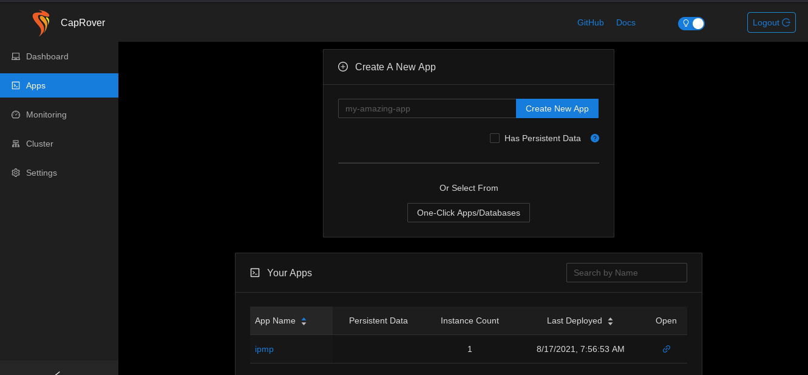
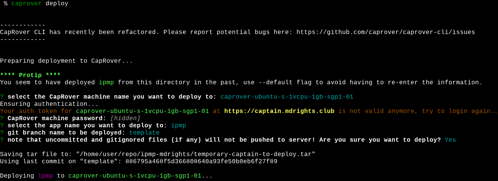
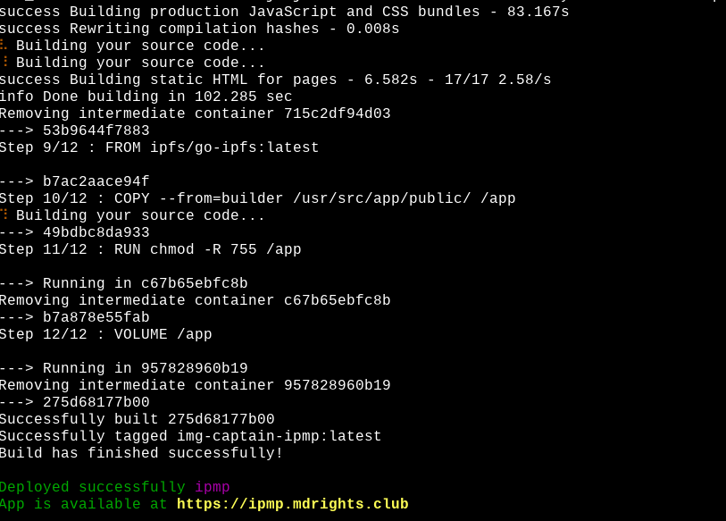
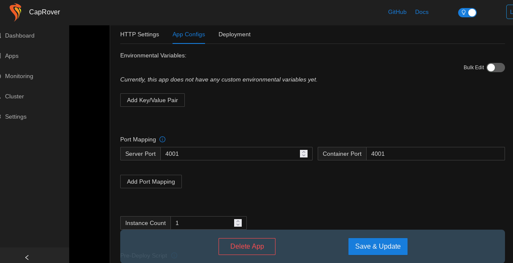
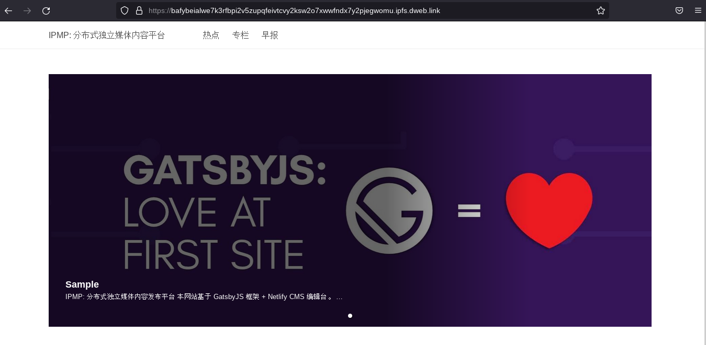

---
---


# 自主搭建一个IPFS网页/网站  

> 前言：网络空间越来越逼仄了，各种控制我们获取信息、独立思考的审查工具越来越强了。我们（特别独立媒体工作者）也需要给自己配备一些抗审查工具，让自己的信息在墙内可以阅读。  
这里要基于上一篇文章：[搭建一个数据自主的问卷调查网站](https://gitlab.com/atgfw/digital-rights/-/blob/main/C%E5%9C%A8%E7%BA%BF%E5%8D%8F%E4%BD%9C/2021-05-04-how-to-selfhost-ohmyform.md)，介绍如何用尽可能少的 IT 技能就能部署一个 IPFS 版的网站（或单个网页）。  
如果你还不知道 IPFS 是什么技术，可以自行搜索，官网在这里：https://ipfs.io  

## 准备工作  

准备工作跟“搭建一个数据自主的问卷调查网站”是一样的，都是要：  
- 买个域名  
- 买个VPS （推荐 DigitalOcean；这里不是做广告，而是 DO 集成了我们将要用到的部署工具 CapRover，比较省事；当然任何的VPS 服务商都是可以的）  
    - 因为我的范例网站用的是 Gatsby 框架和 IPFS，它们的 CPU/内存都消耗挺多，需要至少 1 CPU/2G RAM 的 plan（之后要视文章的量而增加资源，如 2 CPU/4G RAM）。   

这里的网站部署跟问卷网站的部署第一步和第二步都是一样的，请参考。我们直接从部署应用开始。  


## 部署应用  

若成功登录到 Caprover 的管理页面（一般是 `https://captain.your-domain`），那我们可以创建一个新的 app，输入你想为网站起的名字（英文），点击「Create A New App」，这个名字届时会成为网站域名的一部分，如：`https://ipmp.your-domain`。  



下载网站的代码：  
```
  git clone https://gitlab.com/mdrights/ipmp  
```

下一步，真正的部署工作只需要一个命令！（前提是你按照之前的教程安装和setup了 CapRover 咯）    
```
  cd ipmp/  
  caprover deploy  
```

这条命令会显示出一些提示，比如让你选择把代码打包部署到哪个 app（比如刚刚创建的 ipmp），使用哪个分支的代码进行部署（这里我们用 template 分支）。  

这条命令其实会读取代码仓库文件夹内的 `captain-definition` 文件，而这个文件呢，又会读取 `Dockerfile.ipfs` 文件 —— 因此我们会把网站部署成 IPFS 版本。如果你想部署成常规网站的样子，可以修改 `captain-definition` 文件，让其读取 `Dockerfile` 文件，就是个常规网站了 —— 可以通过 `https://ipmp.your-domain` 就可以访问了。  



部署成功会是这样的：  




## 部署后的一点工作  

如果你只是部署常规网站，那只需要在 CapRover 管理页面点击「Enable HTTPS」和 勾选「Force HTTPS ...」（IPFS 版不需要）。  

如果你部署的是 IPFS 版网站，那还有一条命令需要跑。你需要登录到你的 VPS 上（还记得吗，创建 VPS 的时候，需要上传自己的 SSH public key），那么这个时候你就需要用你的 SSH private key 来登录了：  
```
  ssh -i <your-ssh-private-key> root@xx.xx.xx.xx (<-- 你的 VPS IP)  
```

登录进 VPS 后，执行：（用于把我们网站的内容上传到 IPFS 网络去）    
```
  docker exec $(docker ps |awk '{ print $1 }' |head -2 |tail -1) ipfs add -q -r /app |tail -1
```


然后，你会看到一串乱码字符出现了（如 `QmP8Hx5ZKtZRukTdfRyK7s7Z5reBE2ESDPggHAwsayzym6`）。  

恭喜你，复制这串字符，在浏览器里拼接任意一个 IPFS 网关，试试看？（注：可能需要等5～10分钟才能生效）  

比如，官方的网关：  
```
  https://ipfs.io/ + ipfs/ + QmP8Hx5ZKtZRukTdfRyK7s7Z5reBE2ESDPggHAwsayzym6  
```

最后记得上 CapRover 管理页面为 IPFS 开通端口转发：  




## 日常更新的操作  

以后当有文章更新的时候，只需要执行：  
```
  caprover deploy
```
和登录VPS 执行：（会得到一个新的 IPFS hash）   
```
  docker exec $(docker ps |awk '{ print $1 }' |head -2 |tail -1) ipfs add -q -r /app |tail -1
```


# 关于目前 IPFS 公共网关的一些限制

需要点出，IPFS 新旧不同的版本在处理网关域名方面做法不同，而目前来看大部分 IPFS 公共网关都没有更新到比较新的版本（>= 0.5.0）。  

在这里可以看到很多（非全部）IPFS 公共网关的运行状态：https://ipfs.github.io/public-gateway-checker/  

其中左起第三列（Origin）如果是对勾的话就说明该网关已经升级到 0.5.0 或以上版本了。  

这里要区分这个是因为，我们范例网站是用 Gatsbay 写的，并不能很好支持相对路径（relative path）。因此目前的部署方式，只支持新版本的 IPFS 网关（否则无法进行网站内的网页跳转，除非你的网站只有一个网页）  

当然，也仅仅是对旧版本的 IPFS 网关无法网站内跳转啦～  


# TODO

目前只是一点点最基本的 IPFS 功能，还有比如 IPNS 目前还没法配备啦。  


祝发布愉快！




